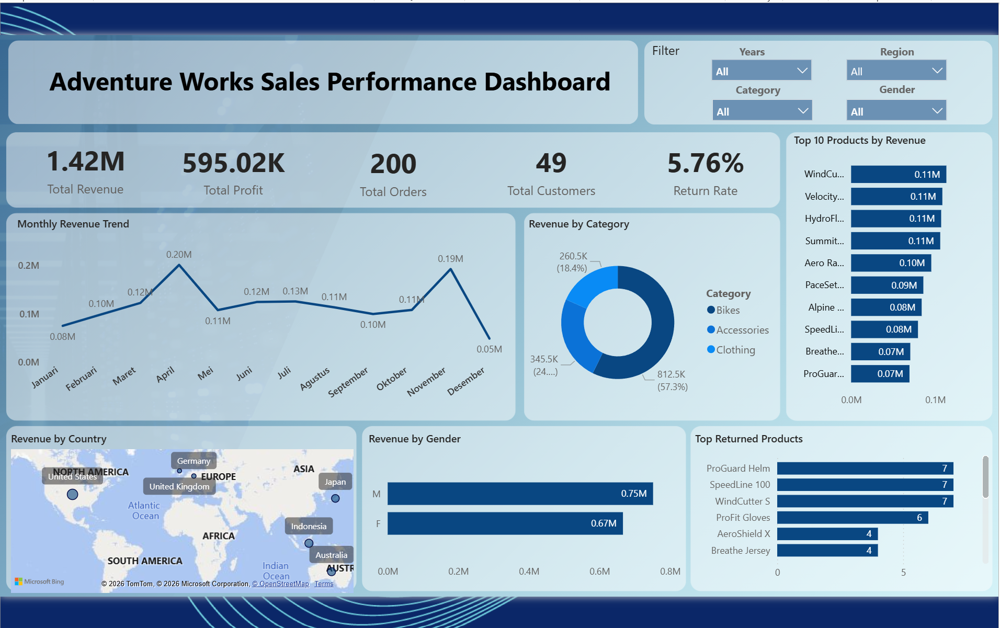

# AdventureWorks Sales Dashboard using Power BI

## Project Overview

This project presents an interactive Business Intelligence dashboard developed using Microsoft Power BI to analyze sales performance from the AdventureWorks dataset.

The dashboard provides insights into revenue, profit, customer behavior, product performance, geographical sales distribution, and product return rates to support data-driven business decisions.

---

## Objectives

- Analyze sales performance
- Identify top-selling products
- Monitor monthly revenue trends
- Evaluate sales performance by country
- Analyze product return rates

---

## Dashboard Preview

> Add dashboard screenshot here



---

## Business Questions

- Which products generate the highest revenue?
- How does revenue change over time?
- Which product category contributes the most revenue?
- Which countries generate the highest revenue?
- Which products have the highest return rates?

---

## KPIs

- Total Revenue
- Total Profit
- Total Orders
- Total Customers
- Return Rate

---

## Tools

- Microsoft Power BI
- Microsoft Excel
- DAX

---

## Dataset

AdventureWorks Sample Dataset

---

## Project Structure

```text
data/
dashboard/
images/
docs/
README.md
```

---

## Author

Joko Santoso

Business Intelligence & Data Analyst Portfolio
